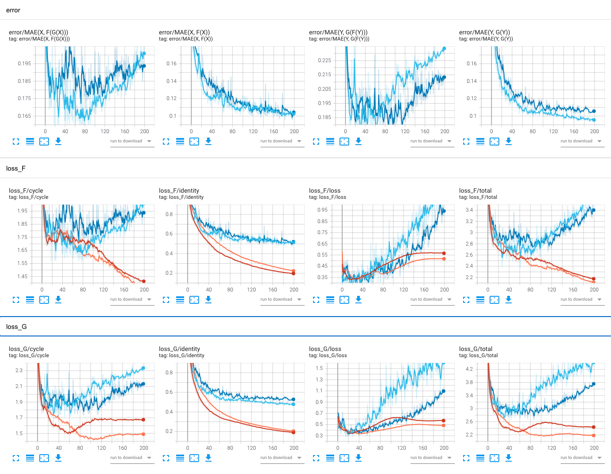

# CycleGAN with multi-GPUs training in TensorFlow 2
This repository provide a concise example on how to use `tf.distribute.MirroredStrategy` with custom training loops in TensorFlow 2. We adapt the CycleGAN ([Zhu et. al. 2017](https://arxiv.org/pdf/1703.10593.pdf)) tutorials from [Keras](https://keras.io/examples/generative/cyclegan) and [TensorFlow](https://www.tensorflow.org/tutorials/generative/cyclegan) and train the model with multiple GPUs. See [towardsdatascience.com/multi-gpus-and-custom-training-loops-in-tensorflow-2-15b4b86b53bd](https://towardsdatascience.com/multi-gpus-and-custom-training-loops-in-tensorflow-2-15b4b86b53bd) for a detailed tutorial.

|  horse → zebra → horse  |  zebra → horse → zebra  |
| :---------------------: | :---------------------: |
|  |  |

## 1. Setup
- create virtual environment for the project
  ```
  conda create -n cyclegan python=3.8
  ```
- activate virtual environment
  ```
  conda activate cyclegan
  ```
- install required packages
  ```
  sh setup.sh
  ```

## 2. Run
- We use the  `horse2zebra` dataset from [TensorFlow Datasets](https://www.tensorflow.org/datasets/catalog/cycle_gan#cycle_ganhorse2zebra) by default.
- Training logs and checkpoints are stored in `--output_dir`
- We can use the following command to train the CycleGAN model on 2 GPUs and store the TensorBoard summary and checkpoints to `runs/`:
  ```
  CUDA_VISIBLE_DEVICES=0,1 python main.py --output_dir runs/ --epochs 200
  ``` 
- Use `--help` to see all available flags.


## 3. Result
- Use `TensorBoard` to inspect the training summary and plots
  ```
  tensorboard --logdir runs/cyclegan
  ```
  